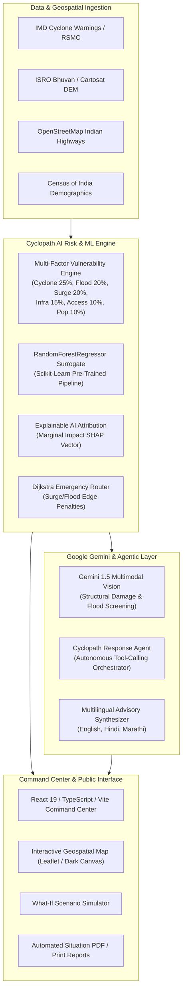

# CYCLOPATH AI 🌀
### *Predict the impact. Protect the infrastructure. Save communities.*

> **Google "Build with AI: Code for Communities" Hackathon**  
> **Track 5: Cyclone Impact & Infrastructure Vulnerability Forecast — Solving for India**

[](#)
[](#)
[](#)
[](#)
[](#)
[](#)

---

## 📌 Executive Summary & 30-Second Pitch

> **"Cyclopath AI is an AI-powered disaster intelligence and infrastructure vulnerability platform for cyclone-prone Indian communities. It combines cyclone atmospheric forecasts, satellite and geospatial data, critical asset telemetry, machine learning, and Google Gemini-powered reasoning to identify vulnerable infrastructure before a cyclone makes landfall. Instead of only telling authorities where the cyclone is heading, Cyclopath AI predicts which hospitals, power substations, bridges, and shelters will fail, explains *why* using Explainable AI (SHAP factors), calculates flood-safe evacuation routes via Dijkstra graph algorithms, and synthesizes prioritized, role-specific emergency action plans in English, Hindi, and Marathi."**

---

## 🎯 The Problem: Solving for India's 7,516 km Coastline

Every year, severe cyclonic storms in the Bay of Bengal and Arabian Sea threaten coastal states including **Odisha, West Bengal, Andhra Pradesh, Tamil Nadu, Maharashtra, and Gujarat**.

While the India Meteorological Department (IMD) provides high-accuracy atmospheric storm tracks, a massive operational gap remains for district disaster authorities:
1. **Raw Weather ≠ Infrastructure Risk**: A 150 km/h wind warning does not tell municipal authorities whether District Hospital A will lose power, or if Bridge B will become impassable due to a 3.5m storm surge.
2. **Delayed Response Protocols**: Emergency teams spend critical pre-landfall hours manually cross-referencing maps, flood elevations, and hospital backup generator logs.
3. **Black-Box Confusion**: First responders cannot blindly trust an opaque AI risk score without transparent, explainable factor attributions.
4. **Multilingual Barrier**: Ground-level emergency teams and citizens in rural coastal belts need urgent guidance in their local languages (**Hindi, Marathi, Odia, Bengali**).

**Cyclopath AI solves this by transforming RAW DATA ➔ RISK SCORE ➔ SHAP EXPLANATION ➔ ACTIONABLE ADVISORY.**

---

## 🏗️ System Architecture



---

## ☁️ Google Cloud Platform Architecture

Cyclopath AI is built ground-up for enterprise cloud resilience:

- **Google Cloud Run**: Serverless container execution for both FastAPI backend and Vite frontend, automatically scaling from 0 to 1,000 instances during disaster spikes.
- **Google Cloud SQL (PostgreSQL + PostGIS)**: Geospatial database storing 100+ critical infrastructure assets, historical cyclone tracks, and real-time hazard cones.
- **Google Vertex AI / Gemini 1.5**: Multimodal satellite and drone damage assessment, agentic response plan synthesis, and citizen alert localization.
- **Google Cloud Storage (GCS)**: Resilient storage for satellite imagery, drone damage photos, and generated PDF disaster reports.
- **Google Cloud Pub/Sub**: Real-time asynchronous telemetry pipeline ingesting live sensor feeds (wind, rainfall, sea-level buoys).
- **Google Cloud Secret Manager**: Zero hardcoded credentials; secure management of database strings and Gemini API keys.
- **Google Cloud Monitoring & Logging**: Structured request tracing, latency tracking, and operational health probes.

---

## ⚡ Key Features

| Feature | Description |
| :--- | :--- |
| **Command Center Dashboard** | Live telemetry for Cyclone SAMUDRA (Category 4 ESCS), atmospheric barometrics, 87+ coastal monitored assets, district vulnerability breakdowns. |
| **Interactive Geospatial Risk Map** | Dark command-center map with cyclone trajectory, cone of uncertainty, wind intensity rings, filtered asset markers, and dynamic risk heatmaps. |
| **Explainable AI (XAI)** | Full SHAP-style factor decomposition for every asset (e.g. `+26 Cyclone Exposure`, `+21 Flood Surge`, `+18 Power Dependency`). |
| **Random Forest Surrogate ML** | Pre-trained Scikit-Learn pipeline scoring structural damage risk, accessibility degradation, and triage priority. |
| **Gemini 1.5 Multimodal Vision** | Upload satellite or drone photos of hospitals, bridges, or seawalls for AI structural risk screening and flood hazard tagging. |
| **Cyclopath Response Agent** | Autonomous tool-calling AI agent executing `get_cyclone_status`, `get_infrastructure_risk`, `get_nearby_shelters` to produce actionable emergency directives. |
| **What-If Scenario Simulator** | Real-time parametric simulation allowing authorities to model wind speed spikes (100–250 km/h), rainfall (50–500 mm), and surge (1–6 m) with before-vs-after deltas. |
| **Dijkstra Safe Routing** | Dynamic pathfinding engine penalizing flooded roadways to find the safest transit corridor between critical assets and evacuation shelters. |
| **Multilingual Localized Advisories** | Instant language switching between **English**, **Hindi (हिंदी)**, and **Marathi (मराठी)**. |
| **4 User Personas** | Tailored viewports for **Disaster Management Authority**, **Municipal Officer**, **Emergency Responder**, and **Public Citizen**. |
| **Zero-Configuration Demo Mode** | Runs immediately out-of-the-box with realistic synthetic coastal telemetry across Odisha, West Bengal, AP, TN, and Maharashtra. |

---

## 📂 Project Repository Structure

```
CycloPath/
├── .gitignore                      # Git ignore rules for Python, Node, secrets
├── .env.example                    # Complete environment variables template
├── docker-compose.yml              # Local multi-container Docker deployment
├── README.md                       # Comprehensive architectural & user documentation
├── backend/
│   ├── Dockerfile                  # Production Python 3.11-slim container
│   ├── requirements.txt            # Python dependencies (FastAPI, Scikit-learn, etc.)
│   ├── server.py                   # Multi-threaded native HTTP server for zero-latency Windows/Linux dev
│   ├── test_all_endpoints.py       # Comprehensive integration test suite (11/11 endpoints)
│   ├── test_server.py              # Health probe testing script
│   └── app/
│       ├── main.py                 # FastAPI ASGI application definition
│       ├── core/
│       │   ├── config.py           # Settings & risk engine weight parameters
│       │   └── database.py         # SQLAlchemy ORM session manager
│       ├── models/
│       │   └── models.py           # Database models (Infrastructure, Cyclones, Alerts, Reports)
│       ├── schemas/
│       │   └── schemas.py          # Pydantic validation schemas
│       ├── services/
│       │   ├── cyclone_service.py   # Cyclone SAMUDRA trajectory & cone coordinates
│       │   ├── risk_engine.py       # Deterministic multi-factor risk calculator & XAI
│       │   ├── ml_service.py        # Random Forest Regressor & analytical SHAP surrogate
│       │   ├── routing_service.py   # Dijkstra graph solver with flood risk penalties
│       │   ├── gemini_service.py    # Google Gemini 1.5 vision & localized advisories
│       │   ├── agent_service.py     # Cyclopath Response Agent tool-calling workflow
│       │   ├── alert_service.py     # Real-time alert lifecycle & broadcast manager
│       │   └── report_service.py    # Formal situational disaster report builder
│       └── data/
│           └── seed_data.py         # 87+ realistic Indian coastal infrastructure assets
└── frontend/
    ├── Dockerfile                  # Multi-stage Node.js build + Nginx alpine production image
    ├── package.json                # React 19, TypeScript, Lucide, Leaflet, Tailwind
    ├── vite.config.ts              # Vite configuration with proxy rules
    ├── index.html                  # HTML entry point with Google Inter typography
    └── src/
        ├── App.tsx                 # Root application controller & tab orchestration
        ├── index.css               # Dark command-center design system & tokens
        ├── types/
        │   └── index.ts            # TypeScript interfaces for all telemetry & responses
        ├── i18n/
        │   └── translations.ts     # Multilingual dictionaries (EN, HI, MR)
        ├── services/
        │   └── api.ts              # Resilient Axios/Fetch API client with demo fallback
        └── components/
            ├── Navbar.tsx          # Top command bar with telemetry, language & role selector
            ├── Sidebar.tsx         # Collapsible navigation sidebar
            ├── LandingPage.tsx     # Hero section, statistics & GCP architecture overview
            ├── CommandCenterDashboard.tsx # Main disaster command dashboard
            ├── RiskMap.tsx         # Interactive geospatial Leaflet map
            ├── InfrastructureCatalog.tsx # Searchable asset catalog with multi-filters
            ├── AssetDetailModal.tsx # Explainable AI modal with SHAP factor bars
            ├── CycloneIntelligence.tsx # Trajectory scrubber & atmospheric gauges
            ├── ScenarioSimulator.tsx # What-If simulation engine with delta analytics
            ├── AIAgentPanel.tsx    # Response Agent with transparent tool-call traces
            ├── EmergencyRouting.tsx # Dijkstra route optimizer with road warnings
            ├── MultimodalInspector.tsx # Gemini 1.5 drone/satellite image inspection
            ├── AlertsPanel.tsx     # Critical threshold broadcast notifications
            ├── ReportsView.tsx     # Printable formal situation assessment reports
            ├── DataSourcesView.tsx # Data provenance registry & system observability
            └── SettingsModal.tsx   # Configurable multi-factor risk engine weights
```

---

## 🚀 Quickstart Guide

### 1. Prerequisites
- **Python 3.10+** (tested on 3.11 & 3.14)
- **Node.js 18+** & **npm**
- *(Optional)* Docker & Docker Compose

### 2. Local Setup (Without Docker)

#### Step 1: Start the Backend
```bash
# Navigate to backend directory
cd backend

# Create and activate a virtual environment
python -m venv venv
# On Windows:
.\venv\Scripts\activate
# On Linux/macOS:
source venv/bin/activate

# Install dependencies
pip install -r requirements.txt

# Start the native robust server (listens on port 8000)
python server.py
```
*Backend is now live at `http://127.0.0.1:8000`. You can verify by visiting `http://127.0.0.1:8000/api/health`.*

#### Step 2: Start the Frontend
```bash
# Open a new terminal and navigate to frontend directory
cd frontend

# Install npm packages
npm install

# Launch Vite dev server
npm run dev
```
*Frontend is now live at `http://127.0.0.1:5173`.*

---

### 3. Running with Docker Compose

To launch the full production-grade stack with a single command:
```bash
# From project root:
docker-compose up --build
```
- Access Frontend at: `http://localhost`
- Access Backend API at: `http://localhost:8000`

---

## 🧪 Automated Integration Tests

Cyclopath AI includes an end-to-end integration test verifying all 11 API endpoints:
```bash
cd backend
python test_all_endpoints.py
```
Output:
```
[PASS] Root: Status 200 (Operational)
[PASS] Cyclones: Status 200 (Cyclone SAMUDRA loaded)
[PASS] Infrastructure: Status 200 (87 assets loaded)
[PASS] Risk Summary: Status 200 (District breakdown ready)
[PASS] Simulation Run: Status 200 (What-if calculation verified)
[PASS] AI Agent Query: Status 200 (Tool calls & recommendations verified)
[PASS] Route Optimize: Status 200 (Dijkstra pathfinding verified)
[PASS] Alerts Feed: Status 200 (Alert rules operational)
[PASS] Latest Report: Status 200 (Assessment report compiled)
[PASS] Health Observability: Status 200 (All subsystems ONLINE)
[PASS] Data Sources: Status 200 (IMD, ISRO, OSM, Census tracked)
```

---

## 🎬 3-Minute Hackathon Demo Script

Follow this chronological walkthrough during your hackathon presentation:

1. **Minute 0:00 – The Hook & Overview**:
   - Open `http://127.0.0.1:5173/`. Show the dark command center.
   - Explain the core thesis: *"When Cyclone SAMUDRA approaches the Odisha coast, district officials don't need another generic weather widget. They need to know which hospital loses power, which bridge floods, and what action to take first."*
2. **Minute 0:45 – Geospatial Intelligence & Explainable AI**:
   - Switch to **Risk Map**. Point out the Cyclone cone, wind intensity rings, and color-coded infrastructure markers.
   - Click on **Puri District Headquarters Hospital**.
   - Show the **Asset Detail Modal**: Point out the **SHAP factor breakdown** (`+26 Cyclone Proximity`, `+21 Storm Surge`, `+18 Critical Power Dependency`) demonstrating that this is explainable AI, not an ungrounded black box.
3. **Minute 1:30 – What-If Scenario Simulation**:
   - Navigate to **Scenario Simulator**.
   - Increase storm surge from 2.5m to 4.2m and wind speed to 195 km/h. Click **"Run What-If Simulation"**.
   - Show the instant **Before vs. After Delta**: *Critical assets increase from 14 to 31 (+121%)*.
4. **Minute 2:10 – Cyclopath Response Agent & Safe Routing**:
   - Click **AI Response Agent**. Click quick query *"Which hospitals need backup power?"*.
   - Show the **transparent tool-calling execution trace** (`get_infrastructure_risk`, `get_cyclone_status`).
   - Switch to **Emergency Routing** to calculate the flood-safe route between Puri Hospital and Konark Shelter.
5. **Minute 2:45 – Multilingual & Multimodal Vision**:
   - Click the language selector in the navbar: switch to **हिंदी (Hindi)** or **मराठी (Marathi)** to prove grassroots India readiness.
   - Switch to **Image Inspector** to demonstrate Gemini 1.5 analyzing structural crack imagery of a coastal seawall.

---

## 🛡️ Responsible AI & Disaster Decision-Support Disclaimer

> **IMPORTANT NOTICE**:  
> Cyclopath AI is designed strictly as a **decision-support prototype** for disaster management personnel, emergency planners, and municipal engineers.  
> 
> - **AI-generated risk scores, damage probabilities, and action recommendations are advisory estimates** and must always be cross-referenced with official advisories issued by the **India Meteorological Department (IMD)**, the **National Disaster Management Authority (NDMA)**, and local State Disaster Management Authorities (SDMAs).
> - Cyclopath AI does not replace certified structural engineering inspections, certified geotechnical surveys, or official government evacuation orders.
> - All demonstration datasets are clearly designated as **Demo Simulation** data for developmental and hackathon evaluation purposes.

---

## 👥 Authors & Team
- **Built for**: Google "Build with AI: Code for Communities" Hackathon
- **Team**: Cyclopath AI Engineering Team
- **Repository**: [https://github.com/rehan0018/CycloPath](https://github.com/rehan0018/CycloPath)
